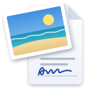

# prev

A fast, open source document and image viewer for Linux, modelled on macOS
Preview. Built in Rust with [iced](https://iced.rs) and
[MuPDF](https://mupdf.com), for Wayland desktops such as Hyprland and
[Omarchy](https://omarchy.org).

> **Status:** the first release, [1.0.0](https://github.com/scrambletools/prev/releases/tag/v1.0.0),
> is out. PDF, image, SVG and Markdown viewing, image editing, PDF markup,
> form filling, signatures, page editing and redaction all work. See the
> [development plan](docs/PLAN.md) for what comes next.


<sub>Documents shown: NIST SP 800-63-3, a US government publication in the
public domain, and a sample form made for prev.</sub>

For a walkthrough of every feature with more screenshots, see
[A tour of prev](docs/GUIDE.md).

## Features

### Available now

- **PDF viewing**
  - Continuous, single page and two page layouts.
  - Zoom, fit to page or width, actual size, Ctrl+scroll zoom.
  - Sharp at any zoom: pages render in tiles on background threads.
  - Password protected documents.
- **Sidebar:** page thumbnails, table of contents and bookmarks, resizable
  by dragging its edge.
- **Search** with every match highlighted and next/previous navigation.
- **PDF markup,** as in Preview's markup toolbar:
  - Highlight, underline and strikethrough text, in five colors.
  - Sketch (strokes become rectangles, ovals and lines when they look like
    one), draw, and shapes: rectangle, rounded rectangle, oval, line,
    arrow, star, polygon, speech bubble, loupe and mask.
  - Text boxes and notes, with fonts, sizes, colors and alignment.
  - Border and fill colors, line widths and dashes.
  - Select, move, resize, restyle and delete annotations; undo and redo.
  - Paste an image or text from the clipboard onto the page, whatever
    tool is chosen (images need wl-clipboard), or drop one where it
    should go.
- **Drag and drop** both ways ([details](docs/GUIDE.md#drag-and-drop)):
  - Drop images, text, files and pages from other windows and apps
    where they should go: images and text onto pages or an image's
    markup, pages and PDFs among the thumbnails, image files into an
    image window, and other files into windows of their own.
  - Drag selected text, areas (as images), pages (to another document,
    or to the file manager as a PDF) and sidebar images (as their files)
    out of prev.
  - Shift moves pages instead of copying them, and takes dropped images
    as files (pictures from web pages are saved to Downloads).
  - Pictures dragged from a browser arrive at full size; where a browser
    gives only their address, prev downloads them with curl if it is
    installed.
  - Rectangular selection copies an area as an image (needs wl-clipboard).
  - Everything is saved as standard PDF annotations that other viewers
    show and edit.
- **Forms:** fill in text fields, checkboxes, radio buttons and drop-down
  menus.
- **Signatures:** draw one (with a choice of ink and pen thickness), type
  your name in a handwriting font, or import a photo or scan; keep as many
  as you like and place them on any page.
- **Page editing:**
  - Select pages in the sidebar (Ctrl+click and Shift+click for more) and
    drag them to reorder.
  - Rotate, delete, crop to a selection, insert a blank page or the pages
    of another PDF, by choosing it or dropping it on the thumbnails.
  - Drag pages to another document window, or out as a PDF file.
  - Copy pages and paste them into the same or another document window,
    with their annotations and form fields.
  - Every page edit can be undone.
- **Redaction:** mark areas or selected text with the Redact tool, then
  apply: the text, images and drawings underneath are removed from the
  file for good, not just covered, and the file is rewritten so no earlier
  revision keeps them.
- **Export** the whole document or selected pages as PDF, optionally
  flattened (markup and filled-in fields drawn into the pages, no longer
  editable), encrypted with a password (AES-256) or made smaller by
  downsampling images, or as PNG, JPEG, multi-page TIFF, WebP or OpenEXR at 72 to
  600 dpi.
- **Highlights and notes** sidebar listing every annotation with its text.
- **Inspector** (Ctrl+I) with the file, the document information (title,
  author, dates, producer, PDF version, encryption) and page size.
- **Autosave:** edits are written in place a moment after you stop, with
  the original kept for Revert To.
- **Text selection and copy**, including across pages; double-click selects a
  word, triple-click a line.
- **Links** inside the document and to the web.
- **Slideshow**, full screen and printing through the system print dialog.
- **Images:** PNG, JPEG, GIF and animated GIF, WebP, AVIF, HEIC, TIFF, BMP,
  ICO, TGA, PNM, QOI, JPEG 2000, OpenEXR, Radiance HDR and camera RAW
  from the cameras [rawler](https://github.com/dnglab/dnglab) supports.
  RAW photos open looking like the camera's own JPEG: prev matches its
  tone curves to the preview the camera stores in the file.
  - Images opened together share one window with a thumbnail sidebar;
    drop more image files on the window to add them.
  - Zoom, fit, actual size, Ctrl+scroll zoom and drag to pan.
  - HEIC and AVIF use the system's libheif when it is installed.
- **Image editing:** rotate, flip, crop, resize and Adjust Color (exposure,
  contrast, saturation, temperature, tint, sepia, sharpness and levels),
  with undo.
  - Edits save automatically, keeping EXIF, color profiles and XMP (in
    JPEG, PNG, WebP and TIFF); the original is kept for Revert To.
  - Inspector with the file's details, camera details, Remove Location
    Info, keywords and description.
  - Markup with the PDF tools (draw, shapes, text, notes, signatures),
    kept while the window is open and drawn into the image on export;
    closing asks first if markup hasn't been exported.
  - Export to PNG, JPEG, WebP, TIFF, BMP, TGA, QOI, PPM or OpenEXR.
- **SVG** drawings, sharp at any zoom; export them as PNG, JPEG and the
  other image formats at one, two or four times their size.
- **Markdown** with tables, task lists, syntax highlighted code and images;
  reloads when the file changes on disk. Text size, search and an
  inspector, as in the other windows.
- **Material Design 3 interface:** an
  [M3 Expressive](https://m3.material.io) look with Roboto Flex, Material
  Symbols icons, spring motion and keyboard focus (Tab and Shift+Tab).
  - Colors are generated from the active Omarchy theme's accent, or from
    prev's own blue, in light or dark.
  - Documents and images share one toolbar layout: what is shown and the
    view on the left, editing, panels and export on the right.
  - In narrow windows, toolbar groups that don't fit move into a More
    menu, which closes once you choose from it.
  - Optionally, the toolbar floats over the document as an M3 floating
    toolbar, with the markup bar along the bottom, and hides while the
    pointer is outside the window.
- **Settings** (the gear button or Ctrl+,): appearance, Omarchy colors,
  the floating toolbar and its transparency, animations, corner radius,
  and where signatures,
  version history and bookmarks are kept. They are saved in
  `~/.config/prev.toml`.
- **Desktop integration**
  - One window per document, with a single running instance.
  - Open files from the file dialog or by dragging them onto a window.
  - Drag and drop with other apps both ways, on Wayland.
  - Follows the system light or dark setting and reduced motion setting.

### Planned

- Revert To for PDFs, as images have it.
- Dragging annotations between documents.

## Install

prev runs on Linux under Wayland (X11 works too) and needs a Vulkan
capable GPU driver. Each [release](https://github.com/scrambletools/prev/releases)
has these packages:

| System | How |
|---|---|
| Arch and Omarchy | Until prev is on the AUR, build it from the release's PKGBUILD (below) |
| Debian and Ubuntu | `sudo apt install ./prev_1.0.0-1_amd64.deb` |
| Fedora | `sudo dnf install ./prev-1.0.0-1.x86_64.rpm` |
| Flatpak | `flatpak install --user prev.flatpak` |
| Any distribution | the AppImage: `chmod +x prev-1.0.0-x86_64.AppImage`, then run it |
| Any distribution | `prev-1.0.0-x86_64-linux.tar.gz`, a plain binary and data files to unpack under `/usr` or `~/.local` |
| Any distribution, with [mise](https://mise.jdx.dev) | `mise use -g github:scrambletools/prev` |

On Arch, until the AUR packages are published:

```sh
mkdir prev && cd prev
curl -LO https://github.com/scrambletools/prev/releases/download/v1.0.0/PKGBUILD
curl -LO https://github.com/scrambletools/prev/releases/download/v1.0.0/prev.install
makepkg -si
```

This builds prev from the release's source, which takes a few minutes
(MuPDF is compiled too).

The packages suggest wl-clipboard, libheif and curl, which prev uses
when they are installed (see [Building](#building)); the Flatpak has them
built in. prev is not on Flathub, but its Flatpak takes the Freedesktop
runtime from there and offers to add the Flathub remote when it is
missing. The Flatpak keeps its settings and data under
`~/.var/app/io.github.scrambletools.prev`.

### What differs between packages

Every package has every feature. Some depend on where prev runs:

- **Wayland or X11:** drag and drop, pasting images and copying an area
  as an image need Wayland. Under X11, text still copies and pastes.
- **HEIC and AVIF** need libheif with its decoders: on Debian and Ubuntu
  the `libheif-plugin-*` packages, on Fedora `libheif-freeworld` from RPM
  Fusion (Fedora's own libheif leaves out HEIC).
- **Flatpak:** prev reaches the home folder; files elsewhere (other
  drives, `/tmp`) open through the file dialog, but dropping them from
  the file manager does not work. Its settings, signatures and versions
  are its own, apart from a non-Flatpak install's.
- **AppImage:** not wired into the desktop by itself, so there is no
  launcher entry or "Open With" unless a tool such as AppImageLauncher
  adds one. It needs glibc 2.35 or newer (Ubuntu 22.04, Debian 12,
  Fedora 36 and later), as do the .deb and .rpm.
- **mise:** installs the release's plain binary and puts only `prev` on
  your PATH, so there is no launcher entry, icon or "Open With"; start
  it from a terminal. It updates with `mise up`; mise waits a day after
  a release before offering it. Like the tarball, it does not install
  wl-clipboard, libheif or curl.
- **Holding Shift** during a drop from another app is seen only under
  compositors that move keyboard focus with the pointer, such as
  Hyprland.
- Only x86_64 packages are built; on ARM, build from the AUR or source.

On Omarchy, windows are slightly see-through by default, which dims
photos and pages. `scripts/install.sh` adds a Hyprland rule keeping prev
opaque; with a package, add it to `~/.config/hypr/hyprland.lua`:

```lua
o.window("^io\\.github\\.scrambletools\\.prev$", { tag = "-default-opacity", opacity = "1 1" })
```

## Building

prev needs Linux, Rust 1.89 or newer, a Vulkan capable GPU driver, and these
build dependencies:

```sh
# Arch
sudo pacman -S clang pkgconf fontconfig freetype2 libxkbcommon wayland
# Debian and Ubuntu
sudo apt install clang libclang-dev pkg-config libfontconfig1-dev libfreetype-dev libxkbcommon-dev libwayland-dev
```

Then build and run:

```sh
cargo build --release
./target/release/prev document.pdf
```

MuPDF is compiled from source as part of the build.

prev runs without these, but uses them when they are installed:

- **wl-clipboard** (`wl-copy`, `wl-paste`): pasting images, and copying
  an area as an image. Text copies and pastes without it.
- **libheif**: opening HEIC and AVIF images.
- **curl**: fetching a picture dropped from a browser that gives only
  its web address; without it the address arrives as text.

To install prev for your user, with a desktop entry so it shows up in the
launcher and "Open With":

```sh
./scripts/install.sh
```

This puts the binary in `~/.local/bin` and the desktop entry, icons and
man page under `~/.local/share`, and on Omarchy adds the opacity rule
above (set `PREV_NO_HYPRLAND=1` to skip it). Settings are in
`~/.config/prev.toml`, which also says where signatures, version history
and bookmarks are kept. Builds made with plain `cargo build` or
`cargo run` are development builds: they keep their own settings
(`~/.config/prev-dev.toml`) and data under `prev-dev`, show "(dev)" in
window titles, and run alongside the installed copy without handing files
to it. Packages are built with `PREV_PRODUCTION=1`; see
[docs/RELEASING.md](docs/RELEASING.md).

## Keyboard shortcuts

| Action | Shortcut |
|---|---|
| Open | Ctrl+O |
| Find, next, previous | Ctrl+F, Ctrl+G, Ctrl+Shift+G |
| Zoom in, out, actual size, fit | Ctrl+=, Ctrl+-, Ctrl+0, Ctrl+9 |
| Go to page | Ctrl+Alt+G |
| Bookmark page | Ctrl+D |
| Sidebar: hide, thumbnails, contents, highlights and notes, bookmarks | Ctrl+Alt+1, 2, 3, 4, 5 |
| Show markup toolbar (PDFs and images) | Ctrl+Shift+A |
| Delete the selected annotation or pages | Delete |
| Paste an image or text from the clipboard | Ctrl+V |
| Copy, paste pages (after clicking a thumbnail) | Ctrl+C, Ctrl+V |
| Select all pages (after clicking a thumbnail) | Ctrl+A |
| Slideshow | Ctrl+Shift+F |
| Full screen | F11 |
| Rotate left, right | Ctrl+L, Ctrl+R |
| Crop to selection | Ctrl+K |
| Undo, redo | Ctrl+Z, Ctrl+Shift+Z |
| Adjust Color (images), Inspector | Ctrl+Shift+C, Ctrl+I |
| Export | Ctrl+Shift+S |
| Print | Ctrl+P |
| Settings | Ctrl+, |

## License

prev is licensed under the [GNU Affero General Public License v3.0 or
later](LICENSE), as required by MuPDF.

The bundled fonts keep their own licenses: Roboto Flex and Dancing Script
under the SIL Open Font License 1.1 ([Roboto Flex](crates/prev/assets/fonts/OFL.txt),
[Dancing Script](crates/prev/assets/fonts/OFL-DancingScript.txt)) and Material
Symbols under the [Apache License 2.0](crates/prev/assets/fonts/LICENSE-MaterialSymbols.txt).
`scripts/build-fonts.py` rebuilds them from pinned upstream sources.
