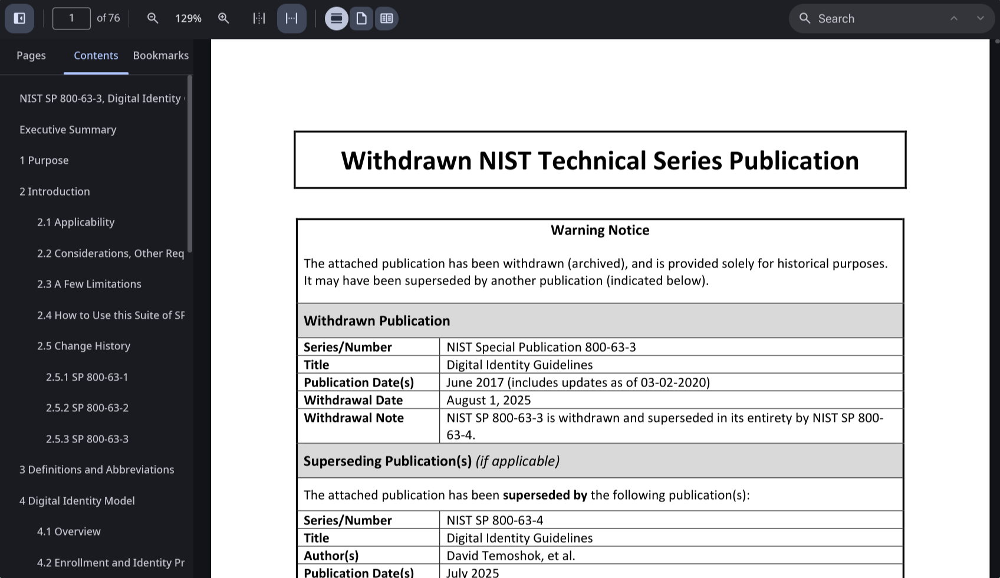
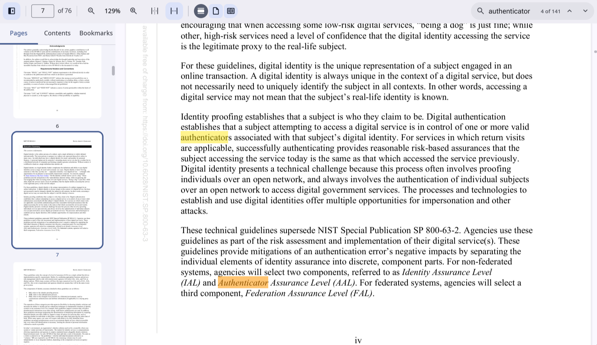
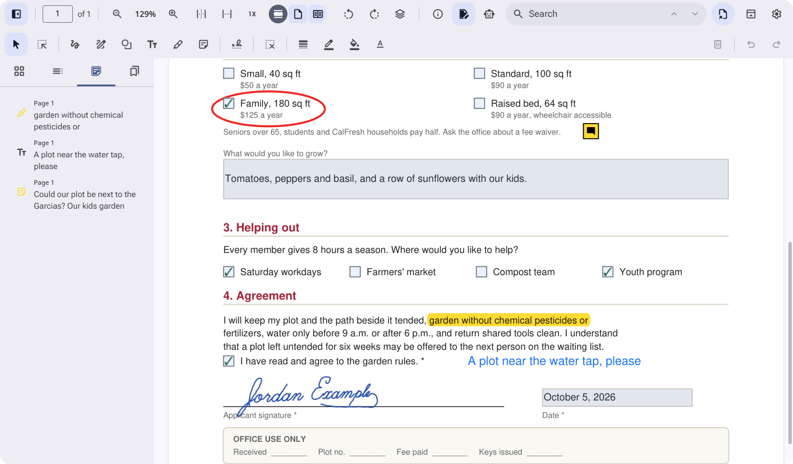
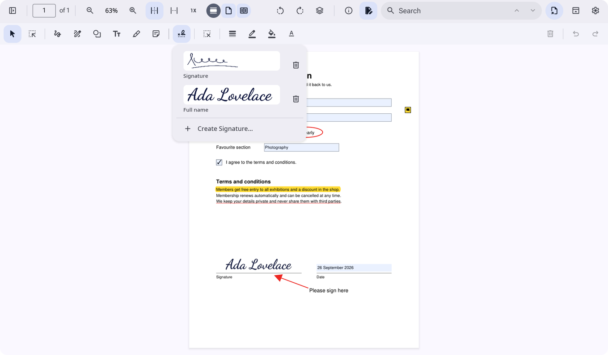
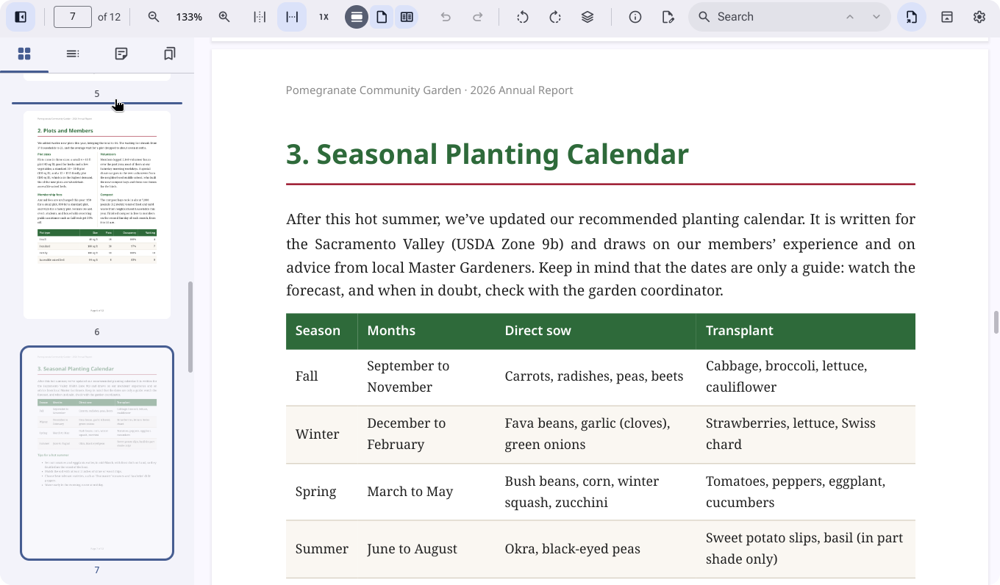
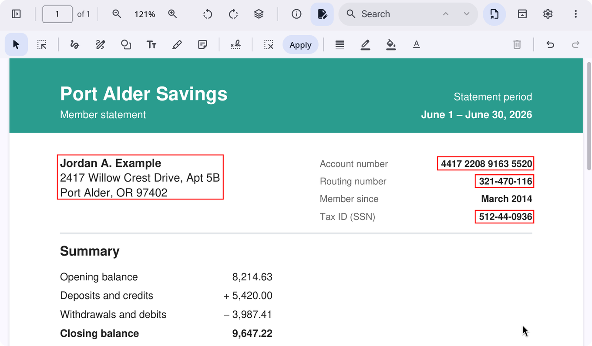

# prev

A fast, open source document and image viewer for Linux, modelled on macOS
Preview. Built in Rust with [iced](https://iced.rs) and
[MuPDF](https://mupdf.com), for Wayland desktops such as Hyprland and
[Omarchy](https://omarchy.org).

> **Status:** early development. PDF, image, SVG and Markdown viewing, image
> editing, PDF markup, form filling, signatures, page editing and redaction
> work today. See the [development plan](docs/PLAN.md).













<sub>Documents shown: NIST SP 800-63-3, a US government publication in the
public domain, and a sample form and sample pages made for prev.</sub>

For a walkthrough of every feature with more screenshots, see
[A tour of prev](docs/GUIDE.md).

## Features

### Available now

- **PDF viewing**
  - Continuous, single page and two page layouts.
  - Zoom, fit to page or width, actual size, Ctrl+scroll zoom.
  - Sharp at any zoom: pages render in tiles on background threads.
  - Password protected documents.
- **Sidebar:** page thumbnails, table of contents and bookmarks, resizable
  by dragging its edge.
- **Search** with every match highlighted and next/previous navigation.
- **PDF markup,** as in Preview's markup toolbar:
  - Highlight, underline and strikethrough text, in five colors.
  - Sketch (strokes become rectangles, ovals and lines when they look like
    one), draw, and shapes: rectangle, rounded rectangle, oval, line,
    arrow, star, polygon, speech bubble, loupe and mask.
  - Text boxes and notes, with fonts, sizes, colors and alignment.
  - Border and fill colors, line widths and dashes.
  - Select, move, resize, restyle and delete annotations; undo and redo.
  - Rectangular selection copies an area as an image (needs wl-clipboard).
  - Everything is saved as standard PDF annotations that other viewers
    show and edit.
- **Forms:** fill in text fields, checkboxes, radio buttons and drop-down
  menus.
- **Signatures:** draw one (with a choice of ink and pen thickness), type
  your name in a handwriting font, or import a photo or scan; keep as many
  as you like and place them on any page.
- **Page editing:**
  - Select pages in the sidebar (Ctrl+click and Shift+click for more) and
    drag them to reorder.
  - Rotate, delete, crop to a selection, insert a blank page or the pages
    of another PDF, by choosing it or dropping it on the thumbnails.
  - Copy pages and paste them into the same or another document window,
    with their annotations and form fields.
  - Every page edit can be undone.
- **Redaction:** mark areas or selected text with the Redact tool, then
  apply: the text, images and drawings underneath are removed from the
  file for good, not just covered, and the file is rewritten so no earlier
  revision keeps them.
- **Export** the whole document or selected pages as PDF, optionally
  flattened (markup and filled-in fields drawn into the pages, no longer
  editable), encrypted with a password (AES-256) or made smaller by
  downsampling images, or as PNG, JPEG, multi-page TIFF, WebP or OpenEXR at 72 to
  600 dpi.
- **Highlights and notes** sidebar listing every annotation with its text.
- **Autosave:** edits are written in place a moment after you stop, with
  the original kept for Revert To.
- **Text selection and copy**, including across pages; double-click selects a
  word, triple-click a line.
- **Links** inside the document and to the web.
- **Slideshow**, full screen and printing through the system print dialog.
- **Images:** PNG, JPEG, GIF and animated GIF, WebP, AVIF, HEIC, TIFF, BMP,
  ICO, TGA, PNM, QOI, JPEG 2000, OpenEXR, Radiance HDR and camera RAW
  from the cameras [rawler](https://github.com/dnglab/dnglab) supports.
  - Images opened together share one window with a thumbnail sidebar.
  - Zoom, fit, actual size, Ctrl+scroll zoom and drag to pan.
  - HEIC and AVIF use the system's libheif when it is installed.
- **Image editing:** rotate, flip, crop, resize and Adjust Color (exposure,
  contrast, saturation, temperature, tint, sepia, sharpness and levels),
  with undo.
  - Edits save automatically, keeping EXIF, color profiles and XMP; the
    original is kept for Revert To.
  - Inspector with camera details, Remove Location Info, keywords and
    description.
  - Export to PNG, JPEG, WebP, TIFF, BMP, TGA, QOI, PPM or OpenEXR.
- **SVG** drawings, sharp at any zoom.
- **Markdown** with tables, task lists, syntax highlighted code and images;
  reloads when the file changes on disk.
- **Material Design 3 interface:** an
  [M3 Expressive](https://m3.material.io) look with Roboto Flex, Material
  Symbols icons, spring motion and keyboard focus (Tab and Shift+Tab).
  - Colors are generated from the active Omarchy theme's accent, or from
    prev's own blue, in light or dark.
  - In narrow windows, toolbar groups that don't fit move into a More menu.
  - Optionally, the toolbar floats over the document as an M3 floating
    toolbar, with the markup bar along the bottom, and hides while the
    pointer is outside the window.
- **Settings** (the gear button or Ctrl+,): appearance, Omarchy colors,
  the floating toolbar, animations, corner radius, and where signatures,
  version history and bookmarks are kept. They are saved in
  `~/.config/prev.toml`.
- **Desktop integration**
  - One window per document, with a single running instance.
  - Open files from the file dialog or by dragging them onto a window.
  - Follows the system light or dark setting and reduced motion setting.

### Planned

- **Image polish:** RAW tone curves matched to the camera's own JPEG, EXIF
  kept in edited TIFFs.
- **Release:** packages for Arch, Flatpak, AppImage, Debian and Fedora.

## Building

prev needs Linux, Rust 1.89 or newer, a Vulkan capable GPU driver, and these
build dependencies:

```sh
# Arch
sudo pacman -S clang pkgconf fontconfig freetype2 libxkbcommon wayland
# Debian and Ubuntu
sudo apt install clang libclang-dev pkg-config libfontconfig1-dev libfreetype-dev libxkbcommon-dev libwayland-dev
```

Then build and run:

```sh
cargo build --release
./target/release/prev document.pdf
```

MuPDF is compiled from source as part of the build.

To install prev for your user, with a desktop entry so it shows up in the
launcher and "Open With":

```sh
./scripts/install.sh
```

This puts the binary in `~/.local/bin`. Settings are in
`~/.config/prev.toml`, which also says where signatures, version history
and bookmarks are kept. Builds made with plain `cargo build` or
`cargo run` are development builds: they keep their own settings
(`~/.config/prev-dev.toml`) and data under `prev-dev`, show "(dev)" in window titles, and run alongside
the installed copy without handing files to it.

## Keyboard shortcuts

| Action | Shortcut |
|---|---|
| Open | Ctrl+O |
| Find, next, previous | Ctrl+F, Ctrl+G, Ctrl+Shift+G |
| Zoom in, out, actual size, fit | Ctrl+=, Ctrl+-, Ctrl+0, Ctrl+9 |
| Go to page | Ctrl+Alt+G |
| Bookmark page | Ctrl+D |
| Sidebar: hide, thumbnails, contents, highlights and notes, bookmarks | Ctrl+Alt+1, 2, 3, 4, 5 |
| Show markup toolbar | Ctrl+Shift+A |
| Delete the selected annotation or pages | Delete |
| Copy, paste pages (after clicking a thumbnail) | Ctrl+C, Ctrl+V |
| Select all pages (after clicking a thumbnail) | Ctrl+A |
| Slideshow | Ctrl+Shift+F |
| Full screen | F11 |
| Rotate left, right | Ctrl+L, Ctrl+R |
| Crop to selection | Ctrl+K |
| Undo, redo | Ctrl+Z, Ctrl+Shift+Z |
| Adjust Color, Inspector | Ctrl+Shift+C, Ctrl+I |
| Export | Ctrl+Shift+S |
| Print | Ctrl+P |
| Settings | Ctrl+, |

## License

prev is licensed under the [GNU Affero General Public License v3.0 or
later](LICENSE), as required by MuPDF.

The bundled fonts keep their own licenses: Roboto Flex and Dancing Script
under the SIL Open Font License 1.1 ([Roboto Flex](crates/prev/assets/fonts/OFL.txt),
[Dancing Script](crates/prev/assets/fonts/OFL-DancingScript.txt)) and Material
Symbols under the [Apache License 2.0](crates/prev/assets/fonts/LICENSE-MaterialSymbols.txt).
`scripts/build-fonts.py` rebuilds them from pinned upstream sources.
