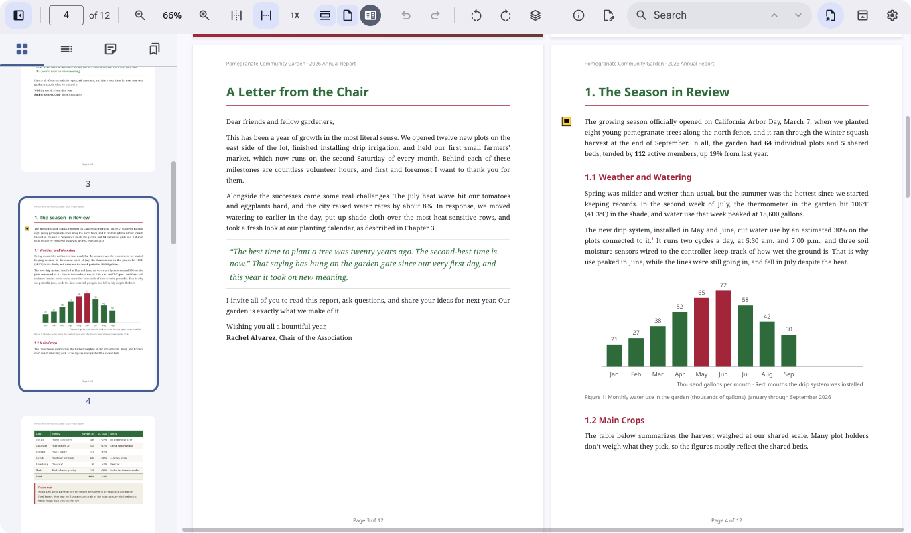
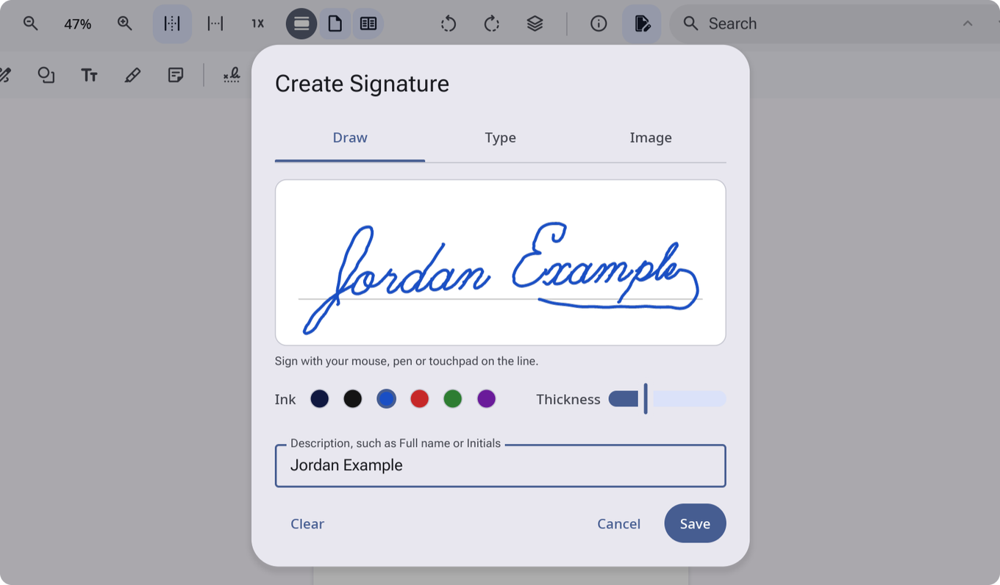
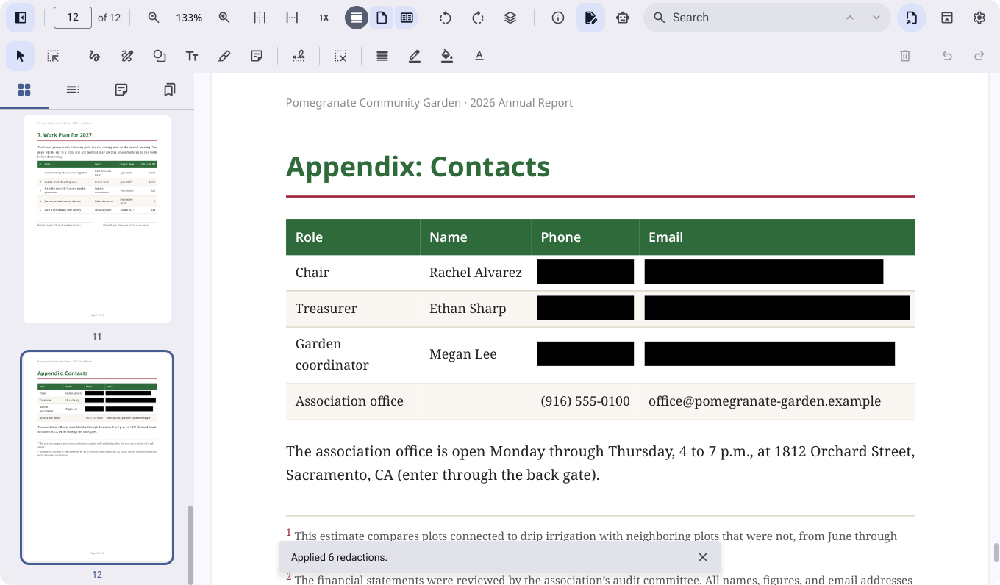
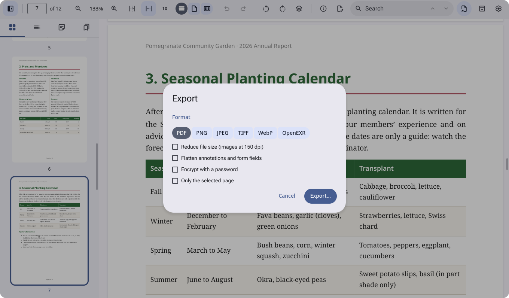
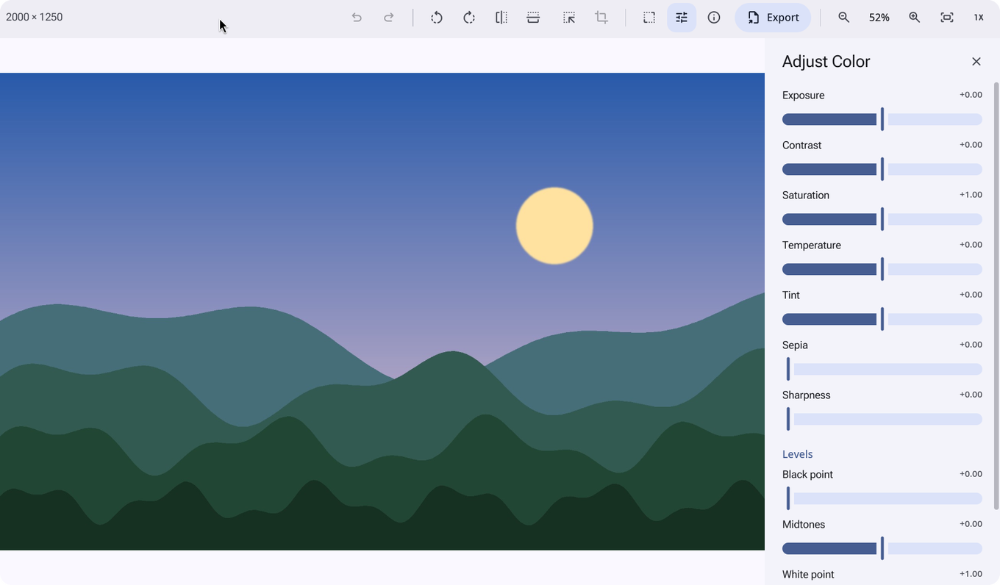
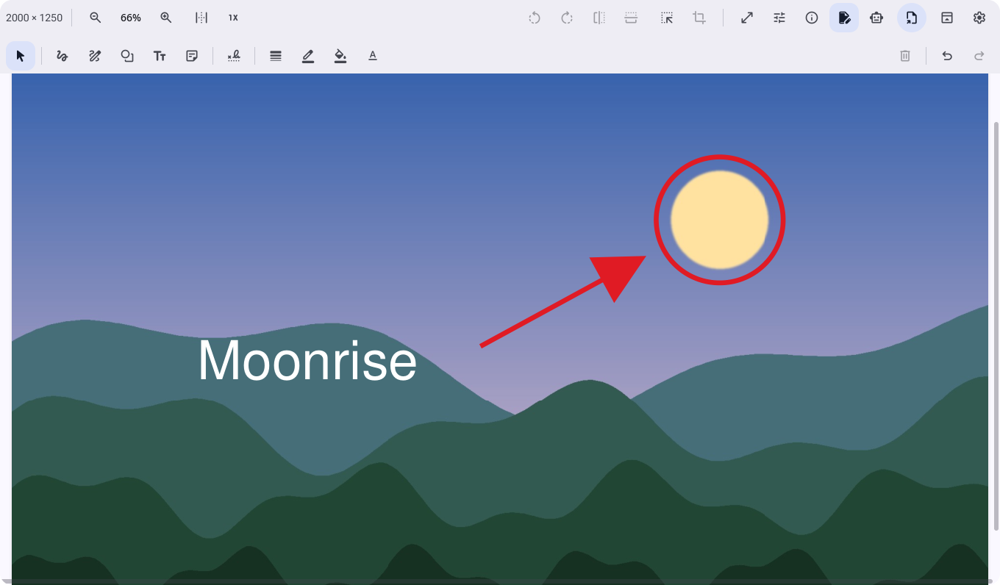
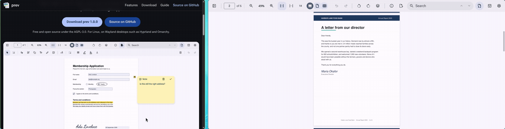
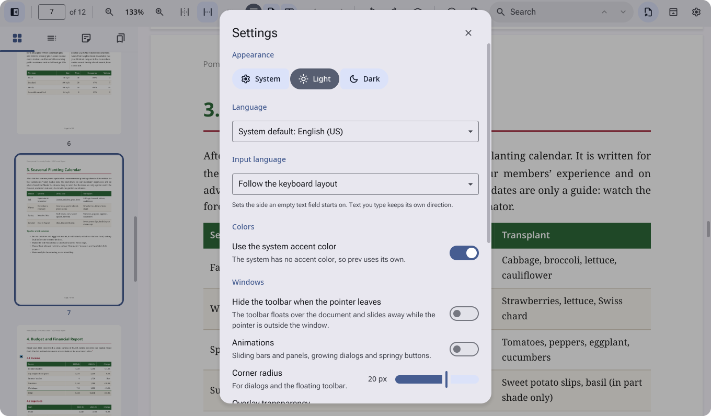
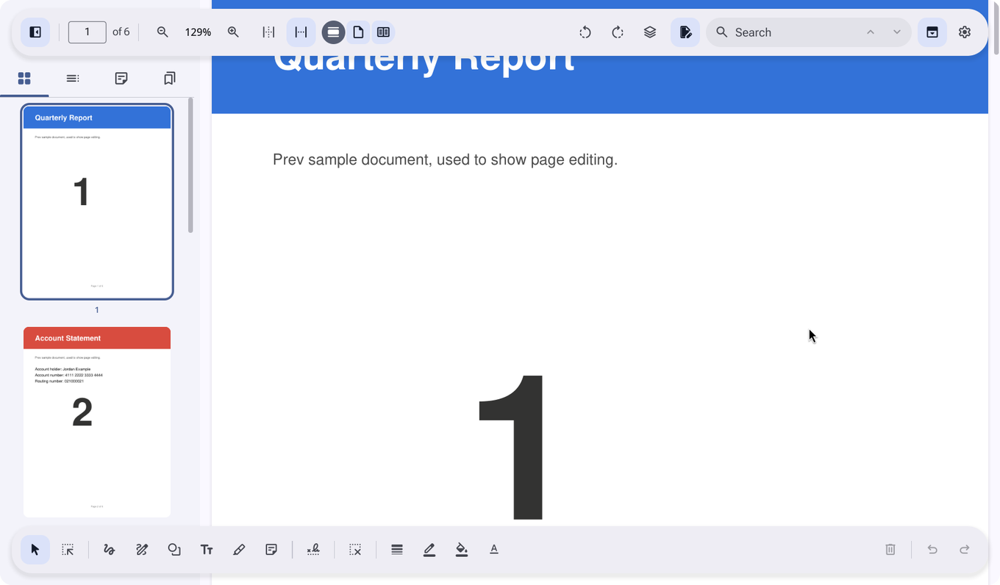

# A tour of prev

This guide walks through what prev does, in the order you are likely to
meet it. Keyboard shortcuts are listed in the [README](../README.md#keyboard-shortcuts).

<sub>Documents shown: NIST SP 800-63-3, a US government publication in the
public domain, and a sample form, a sample annual report, a sample
account statement and a landscape image, all fictional and made for
prev.</sub>

## Opening files

Open files with Ctrl+O, from the file manager's "Open With", from the
command line (`prev report.pdf photo.jpg`), or by dropping them on a prev
window (see [Drag and drop](#drag-and-drop) for drops that do more than
open files). Each document gets its own window; images opened together
share one window with a thumbnail strip. prev keeps a single running instance,
so opening another file from the launcher adds a window instead of
starting over.

## Reading PDFs


The toolbar holds the page number, zoom, fit to page or width, actual
size, and the view mode: continuous scroll, single page or two pages side
by side. Image windows share its layout: what is shown and the view on
the left, editing, the panels and Export on the right.
Ctrl+scroll zooms around the pointer, and pages stay sharp at any zoom
because they render in tiles on background threads.

The sidebar (the button at the far left, or Ctrl+Alt+2 to 5) has four
tabs: page thumbnails, the table of contents, highlights and notes, and
bookmarks (Ctrl+D bookmarks the current page). Drag the sidebar's edge to
make it wider; the thumbnails grow with it.



In two-page mode pages sit in pairs, 1 and 2, 3 and 4, and the arrow keys
move a pair at a time.


Search (Ctrl+F) highlights every match and counts them as it goes;
Ctrl+G and Ctrl+Shift+G step through them. Text can be selected and
copied across pages; double-click selects a word and triple-click a line.
Links inside the document and to the web work, and Ctrl+Shift+F starts a
full-screen slideshow. The inspector (the info button, or Ctrl+I) shows
the file, the document's title, author, dates, producer, PDF version and
encryption, and the page size.

## Marking up


The markup toolbar (the pen button on the right, or Ctrl+Shift+A) follows
Preview's:

- **Select** moves, resizes and restyles annotations; Delete removes the
  selected one.
- **Rectangular selection** chooses an area to copy as an image, or to
  crop the page to (Ctrl+K).
- **Sketch** turns strokes that look like a rectangle, oval or line into
  that shape; **Draw** keeps them as drawn.
- **Shapes**: rectangle, rounded rectangle, oval, line, arrow, star,
  polygon, speech bubble, a loupe that magnifies the page under it, and a
  mask that dims everything but a hole.
- **Text box** and **Note**, with fonts, sizes, colors and alignment.
- **Highlight**, underline and strikethrough over selected text, in five
  colors.
- **Sign** and **Redact**, described below.
- Border color, fill color, line width and dashes for shapes.

Paste (Ctrl+V) puts an image or text from the clipboard on the current
page, whatever tool is chosen: an image at its own size (smaller if it
doesn't fit), text as a text box. An image file copied in the file
manager pastes as the image. Pages copied in prev paste as pages instead,
after the selected one, when they are the latest thing copied.

Everything is saved as standard PDF annotations that other viewers show
and edit. Undo and redo (Ctrl+Z, Ctrl+Shift+Z) cover every change,
markup and page edits alike. Their buttons are on the toolbar, and move
to the markup bar while it is open.

### Forms

Click into text fields and type; checkboxes, radio buttons and drop-down
menus work as they do in other viewers. Values are saved into the form so
other apps read them.

### Signatures


The Sign menu keeps as many signatures as you like. Click one to place it
on the current page, then drag and resize it like any annotation.



Create Signature offers three ways in:

- **Draw** with the mouse, a pen or the touchpad. Choose the ink color
  and the pen's thickness under the pad; changing them redraws what you
  signed.
- **Type** your name, shown in a handwriting font in the ink you choose.
- **Image** takes a photo or scan of a signature on paper and makes the
  paper transparent.

## Editing pages


In the page thumbnails, click a page to select it, Ctrl+click to add
pages and Shift+click to select a range. Then:

- Drag the selection to reorder; a line shows where it will go.
- Rotate with the toolbar buttons (Ctrl+L, Ctrl+R).
- Delete with the Delete key.
- Copy with Ctrl+C and paste with Ctrl+V after the selected page, in the
  same window or another document's. Pasted pages keep their annotations
  and form fields.
- Drop PDF files on the thumbnails to insert their pages where you let
  go.
- Drag thumbnails out of the window to copy the pages into another prev
  window, where they go where you drop them, or into the file manager as
  a PDF. Hold Shift while dropping to move them instead. See
  [Drag and drop](#drag-and-drop).

The Pages menu (the stacked-pages button, beside the rotate buttons) has
Insert Blank Page, Insert from File, Copy and Paste, Crop to Selection,
Select All Pages and Delete. Every page edit can be undone.

## Redacting


The Redact tool marks what should go: drag a box over it, or select text
first and then pick the tool. Marks are ordinary annotations until you
press **Apply** and confirm. Applying removes the text, image pixels and
drawings under each mark from the file and draws black boxes in their
place. The next save rewrites the whole file, so no earlier revision
keeps the content, and prev deletes the earlier versions of the file it
kept. This cannot be undone.



## Exporting



Export (the export button, a page with an arrow near the right of the
toolbar, or Ctrl+Shift+S) writes a new file:

- **PDF**, optionally:
  - **Reduce file size**: images are downsampled to 150 dpi and saved as
    JPEG.
  - **Flatten annotations and form fields**: markup and filled-in fields
    are drawn into the pages and can no longer be edited. Redaction
    marks not yet applied are left out.
  - **Encrypt with a password** (AES-256): the password is needed to open
    the file.
- **PNG, JPEG, TIFF, WebP or OpenEXR** at 72 to 600 dpi, with a quality
  choice for JPEG. TIFF puts every page in one file; the others save a
  file per page, numbered after the name you choose.

Tick "Only the selected pages" to export just the pages chosen in the
sidebar.

## Images



prev opens PNG, JPEG, GIF (animated too), WebP, AVIF, HEIC, TIFF, BMP,
ICO, TGA, PNM, QOI, JPEG 2000, OpenEXR, Radiance HDR and camera RAW.
RAW photos open looking like the JPEG the camera would have made: prev
compares the RAW with the small JPEG preview the camera stores in the
file and gives it the same brightness, contrast and color balance. The
toolbar rotates, flips, crops and resizes (Adjust Size). Adjust Color
(Ctrl+Shift+C) has exposure, contrast, saturation, temperature, tint,
sepia, sharpness and levels. Undo and redo are on the toolbar. The
inspector (Ctrl+I) shows the file and camera details and can remove
location info and edit keywords and a description. Export asks for the
format (PNG, JPEG, WebP, TIFF, BMP, TGA, QOI, PPM or OpenEXR) and, for
JPEG, the quality, then where to save; the choices are kept for the next
export from the window. Drop more image files
on the window to add them to its thumbnail sidebar.



Images take markup too: the Markup button (Ctrl+Shift+A) brings up the
same markup bar as PDFs, with Sketch, Draw, shapes, text boxes, notes and
signatures. Markup stays while the window is open and can be moved,
restyled and undone; rotating, cropping and color changes wait until it
is gone. Paste works on images too, and starts the markup if there is
none yet. Export draws it into the pixels of the copy you save, at the
image's full resolution. Closing the window, or quitting, with markup
you haven't exported asks first, with a button to export.

## SVG and Markdown

SVG drawings open sharp at any zoom, in the image window. They can't be
edited, so the tools that change pixels are greyed out, but Export saves
the drawing as a picture in any of the image formats, at its actual size
or two or four times larger (Size in the Export dialog, which shows the
picture's size in pixels).

Markdown files show with tables, task lists, syntax highlighted code and
images, and reload when the file changes on disk. The toolbar makes the
text larger or smaller (Ctrl+= and Ctrl+-, Ctrl+0 for the normal size),
searches the document (Ctrl+F, then Enter or the arrows for the next and
previous match) and opens the Inspector with the file's details and word
count. Code is colored to suit the light or dark look, and pictures show
at their own size, shrunk only to fit the page. Export saves the whole
document as one picture, in any of the image formats, at its actual size
or twice as sharp; very long documents are scaled down to fit the
16,383 pixel height some formats allow.

## Drag and drop



Drag and drop works both ways: things dragged into prev land where you
let go, and pages, text, areas and images drag out of prev to other prev
windows, the file manager and other apps. While a drag that prev can
take is over a window, the window is highlighted; over the page
thumbnails, a line shows where the pages would go.

### Dropping into a document

| What you drop | Where | What happens |
|---|---|---|
| An image (from a web page, a screenshot tool, or an area dragged from prev) | A page | It goes on the page as an image, centered where you let go, at its own size (96 pixels to the inch), made smaller if it is larger than 80% of the page |
| An image | Outside the pages (the sidebar, around the pages) | As above, in the middle of what is visible of the current page |
| Text (from another app, or selected text dragged from prev) | Anywhere | A text box with that text, sized to fit it, where you let go, or in the middle of the view when outside the pages |
| Pages dragged from another prev window, or a PDF dragged from a web page | The page thumbnails | Inserted at the line |
| The same | A page | Inserted after the selected page |
| PDF files from the file manager | The page thumbnails | Their pages are inserted at the line |
| One image file, with the markup bar open | A page | It goes on the page, like a dropped image |
| Any other files | Anywhere | Each opens in its own window, images dropped together sharing one |

Whatever tool is chosen, dropped images and text become annotations the
select tool can move, and Undo takes them back.

### Dropping into an image window

| What you drop | What happens |
|---|---|
| Image files | They join the window, after its images, in the thumbnail sidebar, which opens; the first of them is shown. Images the window has already are skipped |
| One image file, with the markup bar open, over the picture | It goes on the markup |
| An image or text | It goes on the markup where you let go. If the image had no markup yet, the markup opens and it goes in the middle. Remember to export: markup lasts only while the window is open |
| Other files, such as PDFs | Each opens in its own window |
| Pages, or a PDF dragged from a web page | Nothing: prev says to drop them on a document |

### Dragging out of prev

| What | How to drag it | What it carries |
|---|---|---|
| Selected text | With the Select tool, press on the selected text and drag | The text, for any app that takes text |
| An area | With the rectangular selection tool, choose an area, then press inside it and drag | A PNG image of the area at twice the screen's resolution |
| Pages | Drag thumbnails out of the window (inside the window, dragging reorders them) | The pages: another prev window inserts them; the file manager saves them as a PDF named after the document and pages, such as `Report (pages 2–4).pdf` |
| An image in an image window | Drag it out of the thumbnail sidebar | The file itself, which the file manager copies and other apps open |

A small picture of the pages, area or image follows the pointer while
it is dragged. Dragged images and text are copied; pages are copied
unless you hold Shift. A page dragged out and dropped back on the same
window moves there with Shift, or is copied there without it. An image dragged out of the sidebar and
dropped back on its own window is left alone.

For pages going to the file manager, prev writes the PDF to a private
folder in the system's temporary folder; it is removed when the next
drag starts and when prev quits.

### Holding Shift

Shift changes what a drop does:

- **Pages** dragged between documents move instead of being copied:
  they are removed from the document they came from once they are
  dropped.
- **Images** are taken as files: dropped on an image window they join
  its images, and dropped on a document they open in their own window
  instead of going on the page. A picture that comes without a file,
  such as one dragged from a web page, is saved to your Downloads folder
  first (the one your desktop's user folders name, or `~/Downloads`),
  under its own name, numbered if a file has that name already.
- **A PDF dragged from a web page** is saved to Downloads the same way,
  then drops as a PDF file from the file manager would: inserted among
  the page thumbnails, opened in its own window anywhere else.
- **Text**, and files other than images (such as PDFs from the file
  manager), drop as they would without it.

### Browsers and other apps

- Chromium hands over the picture itself, so it arrives at full size.
  Browsers that give only the picture's web address have it downloaded
  (with curl, when it is installed, within 20 seconds and 64 MB); without
  curl the address arrives as text instead.
- Links to anything other than a picture or a PDF arrive as their
  address, as text; prev does not fetch them.
- Drag and drop does not need wl-clipboard; copying and pasting images
  does.
- Wayland tells the window under a drag nothing about the keys held. prev
  sees Shift during drags from other apps because Hyprland moves the
  keyboard focus with the pointer; under compositors that do not, Shift
  works only for drags that start in prev. Hyprland also never reports
  whether a drop copied or moved, so prev goes by Shift at both ends.

### Not yet

- Annotations cannot be dragged out of a document, nor from one
  document to another; copy an area instead.
- An image window showing a single image has no sidebar to drag it from;
  drag it from the file manager instead.
- The page thumbnails do not scroll by themselves while dragging near
  their top or bottom; the scroll wheel scrolls them during a drag.

## Saving and versions

There is no Save command: edits to PDFs and images are written in place
a moment after you stop, and when a window closes. Before the first
write, prev keeps the original as a version in the version history
folder (`~/.local/share/prev/versions` unless the settings say
otherwise). For images, the inspector's Revert To
list puts an earlier version back; Revert To for PDFs is still to come.

## Settings



Settings opens over the current window, from the gear button at the end
of the toolbar or Ctrl+,. Close it with its close button, Escape or a
click outside it. Changes apply to every window at once:

- **Appearance**: follow the system's light or dark setting, or choose
  one.
- **Use Omarchy accent color**: on Omarchy, colors come from the active
  theme's accent; off, prev uses its own blue.
- **Hide the toolbar when the pointer leaves**: see below.
- **Animations**: off, bars, panels and dialogs appear at once. prev also
  stops moving things when the system asks for reduced motion.
- **Overlay transparency**: lets the page show through the floating
  toolbar, 0 to 90%; its buttons stay solid.
- **Corner radius**: rounds dialogs and the floating toolbar, from
  square corners at 0 to a full pill at 32; the default, 28, is
  Material 3's.
- **Storage**: where prev keeps signatures, version history and
  bookmarks.

### The floating toolbar



With "Hide the toolbar when the pointer leaves" on (or the top-panel
button at the end of the toolbar), the toolbar floats over the document
as a rounded bar, and the markup bar floats along the bottom. They slide
in while the pointer is over the window and go away when it leaves, so
the whole window shows the page. Sidebars and panels stay clear of them.

### Where files go

Settings are kept in `~/.config/prev.toml` (on Windows,
`%APPDATA%\prev\prev.toml`), which lists every setting, including where
prev keeps your files:

```toml
signatures = "~/.local/share/prev/signatures"
versions = "~/.local/share/prev/versions"
bookmarks = "~/.local/share/prev/bookmarks.toml"
```

Change them in the Storage section: type a path (`~` works) and press
Enter or Apply, or pick a folder with Choose. prev checks that the folder
exists and can be written, uses the new place at once and saves it to
the file. Files already at the old place stay there; move them over to
keep using them. The paths are filled in when the file is first made and
then stay as they are.

## Looks

prev follows the system's light or dark setting and reduced motion
setting, and on Omarchy the active theme's accent. In narrow windows,
toolbar groups that don't fit move into a More menu, which closes as
soon as you choose something from it (a button that opens its own menu,
such as Pages, keeps it open under that menu). The search field grows
into whatever room the toolbar has left.
